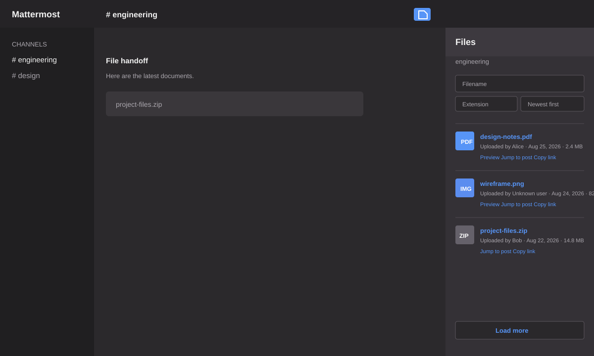

# Mattermost File Overview

Mattermost Team Edition plugin that adds a file button to the channel header. The button opens a responsive right-hand sidebar containing the attachments in the current public channel, private channel, direct message, group message, or archived conversation the user can still read.



The preview above is an illustrative UI preview. The plugin uses the active Mattermost theme at runtime.

## Status and compatibility

Release candidate `v0.3.1` targets Mattermost Team Edition `v11.7.0` through `v11.10.x`:

- `v11.7` is the compatibility-floor / ESR target.
- `v11.10` is the latest target release at the time of this implementation.
- Web and desktop clients are supported. Mobile plugin work is outside v1.

The plugin deliberately uses Mattermost's supported plugin API and webapp registry. It has no direct database connection, KV store, migration, scheduled job, or plugin setting.

## Features

- Browse every attachment with `Load more` pagination, newest first by default.
- Keep the overview controls available while the file list scrolls independently in the RHS.
- Sort by newest, oldest, largest, or smallest; changing the sort starts at page one.
- Search by a literal filename phrase and/or validated extension.
- Search public/private channels with team search and DM/GM conversations with global search.
- Filter native search results again by channel ID before displaying them.
- Show the message context for each file and group adjacent attachments shared by the same post.
- Resolve message context in bulk through Mattermost's supported post API, with safe fallbacks for deleted or unavailable posts.
- Preview supported images, videos, audio, PDFs, and text in a bounded in-sidebar viewer with native controls, keyboard navigation, and a visible close button.
- Keep unsupported formats on an explicit authenticated `Open file` fallback without automatic navigation from the preview viewer.
- Jump to the containing post and copy a full absolute Mattermost permalink to it. Files without a containing post do not show a copy action.
- Resolve uploader profiles through Mattermost client APIs, with an `Unknown user` fallback.
- Refresh the first page when relevant post/file WebSocket events arrive for the active channel.
- Clear cached file metadata, message context, and previews when access to the active conversation is revoked.
- Use a theme-aware file icon, Mattermost CSS variables, visible focus states, localized English strings, and narrow RHS-friendly layout.

v1 intentionally does not provide deletion, public-link generation, team-wide file lists, administrator-only views, or external file sharing.

## Architecture and permissions

The server component exposes:

```text
GET /plugins/com.github.crypt0rr.file-overview/api/v1/channels/{channel_id}/files
```

Supported query parameters are `page` (default `0`), `per_page` (default `50`, maximum `100`), `sort` (`create_at` or `size`), and `direction` (`asc` or `desc`). The plugin requests one extra record from Mattermost's supported `GetFileInfos` API to calculate `has_more`, then returns only the metadata needed by the webapp.

The Mattermost server supplies the trusted `Mattermost-User-Id` header to the plugin process. The endpoint validates the channel ID, requires `read_channel` permission for that channel, and returns `401`, `403`, `400`, or a sanitized `500` as appropriate. File metadata is never returned for a conversation the caller cannot read.

## Search behavior and limitations

Search delegates to Mattermost's native, permission-aware file-search endpoints:

- Public/private channel: team search with `in:~channel-name`.
- Direct message: global search with `in:@other-user`.
- Group message: global search with `in:@user1,user2,...`.

Filename input is sent as a literal quoted phrase. Extension input is normalized and validated before adding `ext:<extension>`. Results are deduplicated by file ID and records from another channel are discarded defensively.

Native search inherits Mattermost configuration and indexing behavior. If file search is disabled or Mattermost reports its configured result limit, the sidebar explains the limitation and keeps ordinary unfiltered browsing available. The plugin never pretends that a partial native search response is a complete browse result.

## Installation

1. Ask a Mattermost administrator to enable plugin uploads and confirm that plugins are enabled in the System Console.
2. Build the installable archive:

   ```bash
   make dist
   ```

3. In Mattermost, open **System Console → Plugins → Management**, upload `dist/com.github.crypt0rr.file-overview-0.3.1.tar.gz`, and enable **File Overview**.
4. Open a conversation and use the file icon in the channel header.

Copied links are full Mattermost post permalinks. Recipients must be signed in and have permission to access the conversation; the plugin does not create public file links.

## Local development

Prerequisites: Go 1.25.x, Node.js 24.x, npm, and a development Mattermost Team Edition instance with plugin uploads enabled.

```bash
# Install webapp dependencies.
cd webapp && npm ci && cd ..

# Generate the server/webapp manifest copies.
make apply

# Fast checks.
make go-test
make webapp-lint
make webapp-typecheck
make webapp-test
make coverage

# Build the production webapp and all supported server executables.
make dist
```

Useful targets:

| Target | Purpose |
| --- | --- |
| `make manifest-check` | Validate `plugin.json`. |
| `make apply` | Propagate manifest data to generated source files. |
| `make go-test` | Run Go tests. |
| `make go-coverage` | Run Go tests and print the server coverage report. |
| `make webapp-test` | Run Jest tests. |
| `make webapp-coverage` | Run Jest tests with the enforced 100% webapp coverage gate. |
| `make webapp-lint` | Run ESLint. |
| `make webapp-typecheck` | Run TypeScript checking. |
| `make webapp-build` | Build only the production webapp bundle. |
| `make dist` / `make package` | Build server binaries, webapp bundle, and `.tar.gz`. |
| `make deploy` | Build and deploy using the starter-template `pluginctl` workflow. |

The current unit-test gates measure 100% statements, branches, functions, and lines for the server and webapp source included in coverage. Type-only declarations are excluded from the webapp measurement.

The server tests use fakes for the narrow Mattermost API surface. No database or Mattermost server is required for the unit suite. A live instance is required for installation and the integration matrix below.

## Release checklist

Before publishing a release:

1. Update `plugin.json` to the release version and matching release-notes URL, then commit that change.
2. Run `make manifest-check`, `make check-style`, `make test-ci`, and `make dist`.
3. Install the produced archive on the latest supported v11.7 patch and v11.10 Team Edition instances.
4. Exercise public/private channels, DMs, GMs, archived-readable conversations, pagination beyond 125 files, multiple files per post, images/documents, deleted posts, and deleted uploaders.
5. Verify private-channel authorization, access revocation, search-disabled behavior, previews, downloads, copied links, post navigation, WebSocket refresh, disable/reactivate, and uninstall.
6. After the versioned commit is merged to `main`, run the matching Makefile release target. It refuses to tag a dirty checkout or a manifest with the wrong version.

The repository includes CI checks for Go tests and coverage, webapp tests and coverage, linting, TypeScript checking, production builds, packaging, and artifact upload.

## Rollback

The plugin is stateless. Rollback is disabling or uninstalling it from **System Console → Plugins → Management**. There are no plugin-owned records, migrations, or scheduled jobs to clean up.

## License and inspiration

This repository is released under the MIT License. It is a clean reimplementation inspired by the user experience of the archived [`mattermost-file-list`](https://github.com/mksondej/mattermost-file-list) project, which was Apache-2.0 licensed. Its obsolete direct-database approach and implementation are not used here; all file access goes through supported Mattermost APIs.
